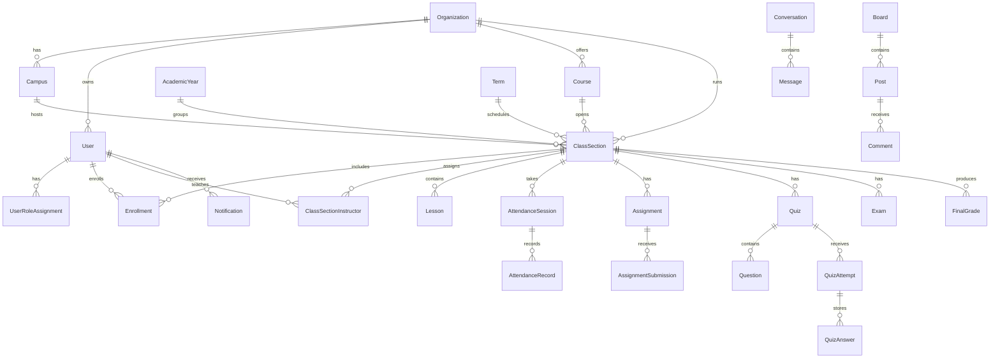

# YJIS LMS DB 설계도

## 개요

데이터베이스는 Prisma ORM과 PostgreSQL을 기준으로 설계되었습니다. 핵심 구조는
조직/캠퍼스, 사용자/역할, 학사 구조, 수업 운영, 평가/성적, 커뮤니케이션,
정책, 파일/문서 영역으로 나뉩니다.

## 핵심 ERD 요약

## 학사 기준 데이터

| 모델 | 설명 |
| --- | --- |
| Organization | 최상위 기관 또는 학교 법인 |
| Campus | 조직 하위 캠퍼스 또는 학교 지점 |
| AcademicYear | 학년도 |
| Term | 학기 또는 분기 |
| GradeLevel | 학년/레벨 |
| Homeroom | 담임반 |
| Department | 학과 또는 부서 |
| Course | 강좌 기본 정보 |
| ClassSection | 실제 운영되는 반 또는 분반 |

## 사용자와 권한

| 모델 | 설명 |
| --- | --- |
| User | 로그인 가능한 사용자 |
| UserRoleAssignment | 사용자 역할과 조직/캠퍼스 범위 |
| StudentProfile | 학생 번호, 학년, 담임반 등 학생 속성 |
| InstructorProfile | 강사 속성 |
| ParentStudentRelation | 학부모와 학생 연결 |

## 수업 운영

| 모델 | 설명 |
| --- | --- |
| ClassSession | 예정된 수업 회차 |
| AttendanceSession | 특정 수업 회차의 출석 체크 세션 |
| AttendanceRecord | 학생별 출석 상태 |
| Lesson | 수업 자료 또는 학습 단위 |
| LearningMaterial | 수업 자료 파일/링크 |
| VideoProgress | 학생별 영상 진행률 |

## 과제와 퀴즈

| 모델 | 설명 |
| --- | --- |
| Assignment | 강사가 생성한 과제 |
| AssignmentSubmission | 학생 제출물, 점수, 피드백 |
| Quiz | 퀴즈 설정 |
| Question | 퀴즈 문항 |
| QuestionOption | 객관식 보기 |
| QuizAttempt | 학생의 퀴즈 시도 |
| QuizAnswer | 문항별 답변 |
| Exam | 시험 일정과 기본 정보 |

## 성적과 문서

| 모델 | 설명 |
| --- | --- |
| ClassSectionGradingConfig | MVP 모듈 비율 성적 설정 |
| GradeCategory / GradeItem / GradeScore | 향후 고급 gradebook용 구조 |
| GradingScale / GradingScaleItem | 점수 범위, letter grade, GPA point |
| FinalGrade | 반별 학생 최종 성적 |
| Transcript / TranscriptTerm / TranscriptItem | 대학식 성적표와 GPA |
| ReportCard / ReportCardItem | K-12 스타일 리포트 카드 |
| GeneratedDocument | 생성 문서 메타데이터 |

## 커뮤니케이션

| 모델 | 설명 |
| --- | --- |
| Board | 학교/반 게시판 |
| Post | 게시글 |
| Comment | 댓글 |
| PostAttachment / CommentAttachment | 게시판 이미지 첨부 연결 |
| Conversation | 메시지 대화방 |
| ConversationParticipant | 대화 참여자와 읽음 상태 |
| Message | 텍스트 메시지 |
| MessageReadReceipt | 메시지 읽음 기록 |
| Notification | 사용자별 인앱 알림 |
| NotificationPreference | 알림 선호도 |

## 정책과 파일

| 모델 | 설명 |
| --- | --- |
| AttendancePolicy | 출석 계산 정책 |
| VideoCompletionPolicy | 영상 완료 기준 |
| GradingPolicy | 과제/성적/문서/GPA 정책 |
| MessagingPolicy | 메시징 정책 확장용 |
| AcademicPolicy | 학사 정책 확장용 |
| FileAsset | MinIO/S3 파일 메타데이터 |

## 주요 제약 조건

- `Enrollment`은 `classSectionId + studentId`로 중복 등록을 방지합니다.
- `AttendanceRecord`는 `attendanceSessionId + studentId`로 학생별 출석 중복을 방지합니다.
- `ClassSectionInstructor`는 `classSectionId + instructorId`로 중복 배정을 방지합니다.
- `ConversationParticipant`는 대화방별 참여자와 `lastReadAt`을 관리합니다.
- `Notification`은 사용자별 읽음/보관 상태를 따로 관리합니다.

## 데이터 보안 원칙

- 학생은 본인 데이터만 조회합니다.
- 학부모는 `ParentStudentRelation`으로 연결된 학생 데이터만 조회합니다.
- 강사는 담당 `ClassSection` 데이터만 관리합니다.
- 관리자는 역할 범위의 Organization / Campus 데이터만 관리합니다.
- 파일은 원본 MinIO URL이 아니라 앱 라우트에서 권한 검사 후 제공됩니다.

